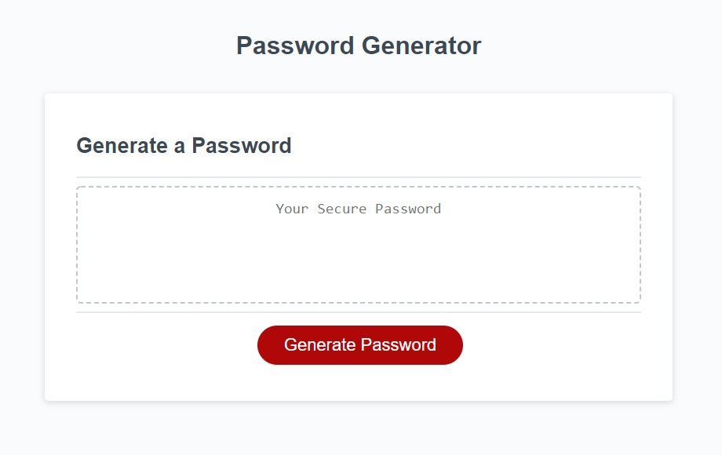
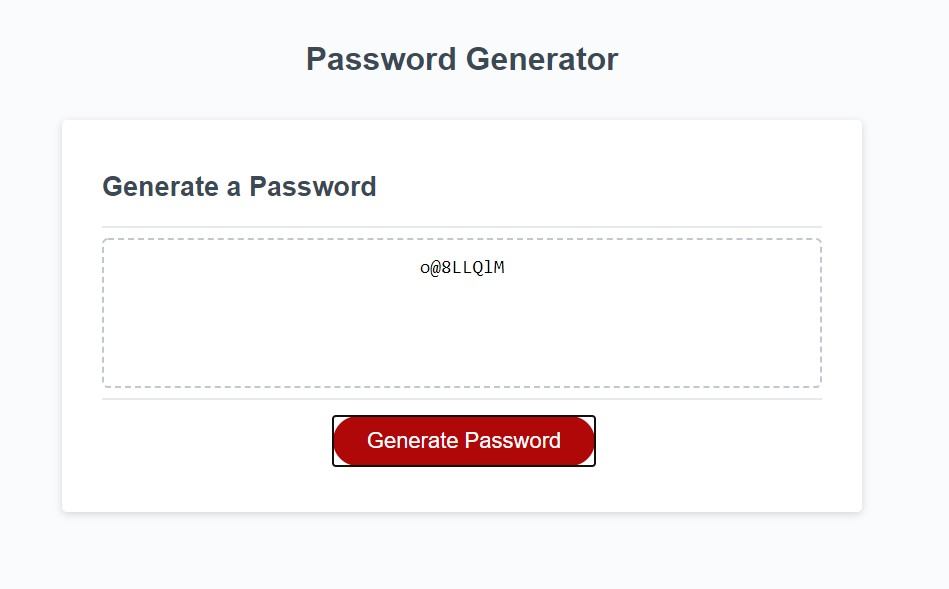

# Password Generator Starter Code

## Description 
This is a password generator. It was created to generate random passwords for clients that deal with sesitive information. The client can choose how many charcters he or she wants in the password (ranging form 8 - 128). They can also choose if they would like to include special charcters, numbers, lowercase letters, and/or capitol letters.

## Photos of Deployed Website

## Link
https://logandpage.github.io/password-generator/

## Installation
-HTML
-CSS
-JavaScript
-Git

## Contributing
Logan Page (logandpage)
Xandromus (Xandromus)

## Author
Xandromus
